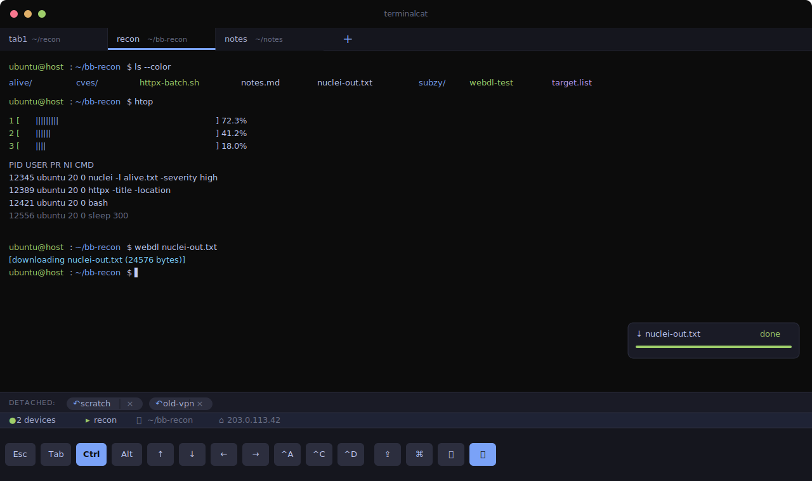
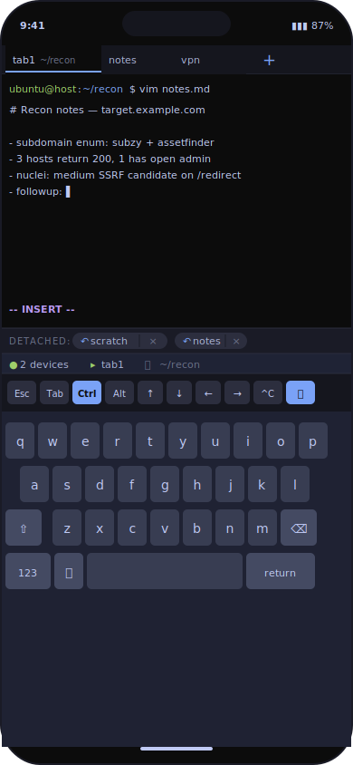
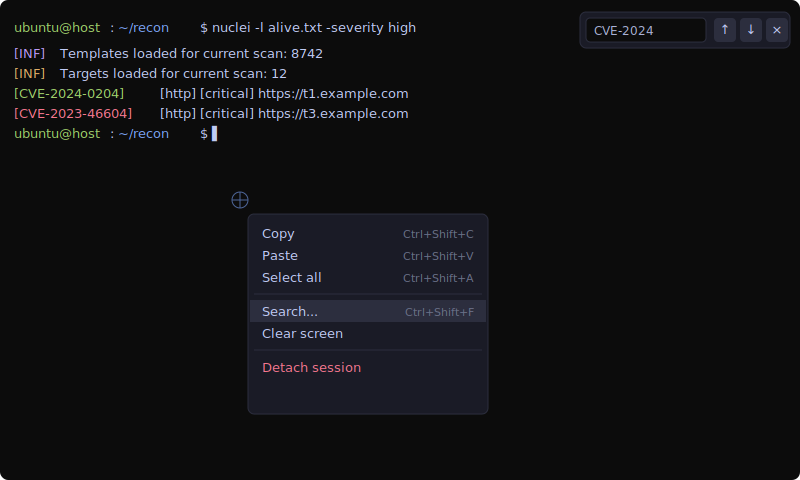

# terminalcat

> A self-hosted web terminal that doesn't kill your processes when you close
> the browser. Multi-tab. Mobile-friendly. Cloudflare-Access-gated. Backed
> by `tmux` for session persistence — closing the tab detaches; reopening
> reattaches; nothing inside dies.

[](LICENSE)
[](https://nodejs.org)
[](https://www.typescriptlang.org/)
[](https://terminalcat.anandsreekumar.com)

> 📖 **Docs:** [terminalcat.anandsreekumar.com](https://terminalcat.anandsreekumar.com) — landing + getting-started, mirroring this README.

> **Status:** personal project shared in case it's useful. PRs welcome,
> issues read as time permits, no support SLA. See [SECURITY.md](SECURITY.md)
> before deploying to anything you care about.



> Animated SVG: simulated session showing a `nuclei` scan, a tab swap, and a
> `webdl` download to the device. Generated content (no real targets in the
> output). Static SVG re-rendered to a real screen GIF is on the
> [TODO list](TODO.md).

---

## Why this exists

I wanted a web terminal I could use from a phone during bug-bounty work
without losing scans every time my laptop slept or my train went into a
tunnel. The existing options had problems:

| | this | code-server | gotty / wetty / ttyd |
|---|---|---|---|
| Closes browser → process keeps running | ✅ (tmux owns it) | ❌ (kills bash on disconnect) | ⚠️ no built-in tmux integration |
| Multi-session tabs | ✅ | ❌ (single shell) | ❌ |
| Mobile-friendly (helper bar, sticky modifiers, pinch-zoom font) | ✅ | ⚠️ minimal | ❌ |
| File upload + download (web ↔ box) | ✅ (drag-drop + `webdl` CLI) | ⚠️ via VS Code only | ❌ |
| Cloudflare Access JWT verified at origin | ✅ | ⚠️ via reverse proxy | ⚠️ via reverse proxy |
| PWA-installable (Add to Home Screen) | ✅ | ✅ | ❌ |

If those bullets describe what you want, terminalcat may fit. If you need
multi-user partitioning, IDE features, collaboration, or commercial
support — try something else.

---

## Screenshots

> *SVG mockups hand-built from the actual Tokyo-Night palette terminalcat
> ships with. They render natively in GitHub. Real device screenshots
> can replace these in [docs/screenshots/](docs/screenshots/) anytime —
> see that directory's README for which file goes where.*

**Desktop** — multi-tab, helper bar, info bar, detached chips, transfer card, the works:



**Mobile (PWA, keyboard up)** — helper bar floats above the keyboard,
helper-bar `🖱` button toggles tmux-mouse mode, `Ctrl` is sticky:



**Right-click on the terminal** — small Windows-style context menu at the
cursor (long-press on mobile opens an action sheet with the same items):



## Architecture

```
   browser  ──tls──▶  Cloudflare Access  (SSO + JWT mint)
                            │
                            ▼  signed JWT in Cf-Access-Jwt-Assertion
                    cloudflared tunnel  (QUIC outbound; no inbound port)
                            │
                            ▼  http
                    127.0.0.1:7682   ←—  bind enforced loopback-only
                            │
                    ┌───────┴───────┐
                    │  src/server   │   ws upgrade gate (jose verify aud+iss)
                    │   (Node + ws) │   tagged binary frames + JSON control
                    └───────┬───────┘
                            │
                    ┌───────┴────────┐
                    │  node-pty       │  one PTY child per attached session
                    └───────┬────────┘
                            │
                       tmux server  ←—  source of truth; outlives Node
                            │
                       bash, vim, nuclei, …  (your processes)
```

Each browser tab corresponds to a tmux session. Detaching a tab keeps the
session running; reattaching reconnects to the same processes. Closing the
browser doesn't kill anything inside.

See [PROTOCOL.md](PROTOCOL.md) for the wire format.

---

## Performance

Numbers from the reference build (Node 20.20.2, aarch64 Debian 12, single
loopback origin behind Cloudflare Access):

| | |
|---|---|
| Cold start (`systemctl start` → port listening) | ~580 ms |
| WS connect → first server message | 2 ms warm, ~14 ms cold |
| Keystroke round-trip (stdin → bash echo, through PTY+tmux+bash) | **median 0.8 ms · p95 1.1 ms** |
| Stdout throughput through the WS+PTY+tmux pipe | ~1.2 MB/s |
| Resize control → PTY reflects new size (`stty size` round-trip) | median 2.9 ms |
| Idle RSS / threads / FDs | 53 MB · 11 · 25 |
| RSS under fuzz/load | ~88 MB peak |
| Survived in-house fuzz: ~100 hostile WS frames | no crash, no panic |

Method: `node -e` clients on loopback with the actual binary protocol
(`src/protocol.ts`), measured via `performance.now()`. The reproducer
batteries are not in the repo (they were one-shot harnesses), but the
methodology is straightforward to recreate against any deployment.

Caveat: the ~1.2 MB/s terminal-throughput number is bounded by the TTY +
tmux pass-through, not by Node or `ws`. For bulk data, use the file
upload/download paths — those skip the TTY layer entirely.

---

## Prerequisites

Hard requirements:

- **A Linux box** to host on (tested on Debian 12, Ubuntu 22.04+, Fedora
  39+; aarch64 and x86_64 both work).
- **A Cloudflare account.** Free tier is enough.
- **A domain managed in Cloudflare.** terminalcat is exposed via Cloudflare
  Tunnel + Cloudflare Access — both bind to a hostname under a Cloudflare-
  managed zone. If your domain isn't in CF, you'll need to either add it
  (free) or pick a different reverse-proxy + auth front-door (out of scope
  here).
- **Cloudflare Zero Trust enabled** on the account. Free for up to 50
  users. Sign up at https://one.dash.cloudflare.com/.

The installer brings in everything else — Node 20+, pnpm (via corepack),
tmux, git, cloudflared, build tools — using your distro's package manager.

---

## Quick install

One-liner (works on Debian/Ubuntu/Fedora/RHEL/Arch — installer auto-detects):

```bash
curl -fsSL https://raw.githubusercontent.com/anandsreekumaras/terminalcat/main/scripts/install.sh | bash
```

Or after cloning manually:

```bash
git clone https://github.com/anandsreekumaras/terminalcat.git ~/terminalcat
cd ~/terminalcat && ./scripts/install.sh
```

The installer:

1. Detects your OS / package manager (apt / dnf / yum / pacman).
2. Installs missing prerequisites (Node 20 LTS via NodeSource, pnpm via
   corepack, tmux, git, build-essential / gcc-c++, cloudflared).
3. Clones/updates the repo.
4. Runs `pnpm install` (compiles node-pty from source on aarch64).
5. Prompts interactively for `CF_ACCESS_TEAM_DOMAIN`, `CF_ACCESS_AUD`,
   and `ALLOWED_ORIGIN` (the public URL users will load the app at).
   See **Cloudflare setup** below for where to find these.
6. Optionally installs the systemd unit (`Restart=always`, non-root user).
7. Optionally symlinks the `webdl` and `webnotify` CLI shims into
   `/usr/local/bin`.

Idempotent — re-run anytime to update / reconfigure. Override defaults
with `TERMINALCAT_REPO=…` (your fork) or `TERMINALCAT_DIR=…` (custom path).

---

## Cloudflare setup (required)

terminalcat does **not** open a port on the public internet. Traffic
reaches it through a Cloudflare Tunnel, gated by a Cloudflare Access
application. You only need to do this once per terminalcat install.

### 1. Pick a hostname

Decide on the URL you want, e.g. `shell.example.com`. The domain part
(`example.com`) must be a zone in your Cloudflare account.

### 2. Create the tunnel

On the box that's running terminalcat:

```bash
cloudflared login                          # one-time browser SSO
cloudflared tunnel create terminalcat       # writes credentials JSON
cloudflared tunnel route dns terminalcat shell.example.com
```

`cloudflared tunnel create` prints a UUID and a path to a credentials JSON.
Don't edit `deploy/cloudflared.yml` in-place — it's the template that gets
shared via the repo. Make a per-machine copy in `~/.cloudflared/`:

```bash
mkdir -p ~/.cloudflared
cp deploy/cloudflared.yml ~/.cloudflared/terminalcat.yml
$EDITOR ~/.cloudflared/terminalcat.yml
# replace REPLACE-WITH-YOUR-TUNNEL-UUID (both lines) with the UUID printed above
```

Foreground run (good for the first sanity check):

```bash
cloudflared tunnel --config ~/.cloudflared/terminalcat.yml run
```

For ongoing use install it as a systemd service so it comes back after
reboots — `scripts/install.sh` does this for you when `~/.cloudflared/terminalcat.yml`
exists. Manual install:

```bash
sudo cp deploy/cloudflared-terminalcat.service /etc/systemd/system/
sudo sed -i "s|^User=ubuntu|User=$USER|;s|^Group=ubuntu|Group=$(id -gn)|;s|/home/ubuntu/.cloudflared|$HOME/.cloudflared|g" \
  /etc/systemd/system/cloudflared-terminalcat.service
sudo systemctl daemon-reload
sudo systemctl enable --now cloudflared-terminalcat.service
sudo journalctl -u cloudflared-terminalcat -f   # tail logs to confirm
```

> ⚠️ **Don't use `sudo cloudflared service install`.** That command installs
> a single token-based unit and either collides with or overwrites any
> existing `cloudflared.service` you have (e.g. for another tunnel).
> The dedicated `cloudflared-terminalcat.service` above sits cleanly
> alongside, uses the credentials-file pattern (no rotating tokens),
> and runs as your unprivileged user.

### 3. Create the Cloudflare Access application

Cloudflare Zero Trust dashboard → **Access** → **Applications** →
**Add an Application** → **Self-hosted**.

| Field | Value |
|---|---|
| Application name | `terminalcat` |
| Application domain | `shell.example.com` |
| Session duration | 24h (or shorter — your call) |

Add a policy:

- **Action:** Allow
- **Selector:** Emails → your email address
  *(Don't use "any email from <my domain>" — old or compromised employees may still hold the address.)*

Save. Open the new app → **Overview** tab → copy:

- **Application Audience (AUD) Tag** — a 64-char hex string.
- Your **team domain** — the part before `.cloudflareaccess.com`. Find it
  top-left of the Zero Trust dashboard, or under Settings → General.

Paste both into `.env`, plus the canonical URL users will load the app at
(used as a server-side CSWSH defense — recommended in production):

```bash
CF_ACCESS_TEAM_DOMAIN=acme
CF_ACCESS_AUD=0000000000000000000000000000000000000000000000000000000000000000
ALLOWED_ORIGIN=https://shell.example.com
```

`ALLOWED_ORIGIN` is optional. If set, WS upgrades whose `Origin` header
doesn't match get a 403; missing Origin (CLI tools, monitoring) falls
through to the JWT check. Cloudflare Access' default `SameSite=Lax`
cookie already blocks the obvious browser CSWSH path, but this hardens
the `SameSite=None` edge case at zero cost.

The installer prompts for all three — you can skip this step and answer
the installer's questions instead.

### 4. Visit the URL

```
https://shell.example.com/
```

You should be redirected to `https://<team>.cloudflareaccess.com/...` for
the SSO login flow. After authenticating, you land back on terminalcat
with the bash prompt.

---

## Run in Docker (alternative deploy path)

> **Honest framing first.** Docker gives you shell **inside the container**,
> not on the host. Read this before assuming Docker is what you want:
>
> - **"I want a portable, sandboxed remote dev environment reachable from my
>   phone"** → ✅ Docker is exactly right. The container has its own bash,
>   its own tmux server, its own `apt` packages. Persistent files live on a
>   named volume. The host's `/etc`, `/home`, processes, etc. are invisible
>   to the web shell.
> - **"I want to manage my actual VPS via web shell"** → ❌ Docker is the
>   wrong tool. The container's shell can't see your host's running services
>   without privileged mounts (`docker.sock`, `/`) that defeat the
>   sandboxing. Use the bare-metal install (`scripts/install.sh`) instead.

### Quick start

```bash
git clone https://github.com/anandsreekumaras/terminalcat.git
cd terminalcat

# 1. Set up env (edit values from your Cloudflare Access app)
cp .env.example .env
$EDITOR .env

# 2. Build the image
docker compose build

# 3. Run terminalcat
docker compose up -d

# 4. (Optional) also run cloudflared as a sidecar — set
# CLOUDFLARE_TUNNEL_TOKEN in .env first, then:
docker compose --profile tunnel up -d
```

The container listens on `127.0.0.1:7682` via `network_mode: host`, same
threat model as the bare-metal install (loopback only — nothing reaches
the network without going through `cloudflared`).

### Image stats

| | |
|---|---|
| Base | `node:20-bookworm-slim` (multi-stage build prunes dev deps) |
| Compressed image | ~150 MB |
| On-disk after pull | ~330 MB |
| Includes | Node 20, `tmux`, `tini` (for clean SIGTERM forwarding), the compiled app |
| Excludes | build tools, source maps stay (debugging help), test framework |

### Persistence

`/home/node` inside the container is mounted to the named volume
`terminalcat-home`. Anything you write there — `~/.bashrc`, target lists,
`apt`-installed tools, tmux session output — survives `docker compose down`.

To also expose host directories into the container, add a bind mount in
`docker-compose.yml`:

```yaml
volumes:
  - terminalcat-home:/home/node
  - ./recon:/home/node/recon    # host's ./recon → container's ~/recon
```

### Limitations

- The shell **cannot see the host filesystem or processes**. By design.
- The `webdl` / `webnotify` shims work, but their UNIX socket lives inside
  the container at `/tmp/terminalcat-1000.sock` — they can't be called from
  outside the container.
- If you mount `docker.sock` to manage Docker from the web shell, you've
  effectively given that shell root on the host. Don't, unless you really
  meant it.

## Mobile install (PWA)

After the URL is reachable, install it as an app on your phone:

- **iOS Safari:** Share → **Add to Home Screen**. Opens fullscreen, no URL bar.
- **Android Chrome:** stay on the page a few seconds → install icon
  appears in the URL bar (or `⋮` menu → **Install app**).

The Add-to-Home-Screen experience uses the included `manifest.webmanifest`
+ `sw.js` (a no-op service worker that exists only to satisfy install
criteria — there is no caching). Standalone display: no browser chrome,
helper bar at bottom above the keyboard, pinch on the terminal area to
adjust font size (10–24 px, persisted in `localStorage`).

---

## Usage notes

- **Tabs**: top bar. `+` creates `tab1`, `tab2`, …. Click to switch.
  Right-click (desktop) / long-press (mobile) → Rename / Detach / Kill.
  Double-click to rename.
- **Right-click in the terminal**: Copy / Paste / Select all / Search /
  Clear screen / Detach.
- **Keyboard shortcuts** (all desktop):
  - `Ctrl+Shift+C` — copy selection
  - `Ctrl+Shift+V` — paste from clipboard
  - `Ctrl+Shift+A` — select all (incl. scrollback)
  - `Ctrl+Shift+F` — search in scrollback
  - Plain `Ctrl+C/A/V` still go to the shell (SIGINT / start-of-line /
    verbatim-insert) — same convention as `gnome-terminal`.
- **Helper bar (mobile)**: Esc / Tab / sticky Ctrl / sticky Alt / arrows /
  `^A` / `^C` / `^D` / upload / snippets / search / mouse-mode toggle.
- **Mouse-mode toggle (🖱 in helper bar)**: ON (default) = scroll wheel
  scrolls tmux's scrollback, mouse selection requires Shift+click+drag.
  OFF = native xterm selection works without Shift, scroll wheel sends
  ↑/↓ keys to bash readline (= command history navigation). Pick the
  trade-off you prefer.
- **File upload**: drag a file onto the terminal area (desktop) or tap
  ⇪ in the helper bar (mobile picker). Lands at the active tab's
  `pane_current_path`. Max 500 MB / 1 concurrent / session.
- **File download**: from inside any tab,
  `webdl /path/to/file` — file streams to your browser as a download.
  Requires the shim symlinked in PATH (the installer offers this).
- **Notifications**:
  - `discord-notify "scan finished"` — POSTs to a configured Discord webhook (works whether or not a browser tab is open; webhook URL in `~/.config/discord-webhook` or `$DISCORD_WEBHOOK_URL`). Pipe-friendly: `cmd | tail -5 | discord-notify`.
  - `webnotify "scan finished"` — pings the active
  browser tab; if the page is backgrounded, a real OS notification fires
  (browser permission required, asked on first interaction).
- **Detached sessions**: appear as chips in the bottom bar above the
  helper bar — tap to reattach, × to kill.
- **Active info**: bottom info strip shows `● N devices · ▸ <session> ·
  🗀 <cwd> · ⌂ <your-ip>`.

---

## Development

```bash
git clone https://github.com/anandsreekumaras/terminalcat.git
cd terminalcat
corepack enable && corepack prepare pnpm@latest --activate
pnpm install
cp .env.example .env  # fill in CF_ACCESS_TEAM_DOMAIN and CF_ACCESS_AUD
pnpm dev              # tsx watch on src/server.ts
```

Type-check: `pnpm exec tsc --noEmit`. There's no test suite yet — see
[TODO.md](TODO.md). Manual verification per checkpoint is described in
the source comments and PROTOCOL.md.

### Repo layout

```
src/                  # backend (Node + TypeScript strict)
  server.ts           # http + ws bootstrap, control router, lifecycle
  auth.ts             # jose JWKS cache + jwtVerify(aud, iss)
  config.ts           # .env loader + required-env validator
  log.ts              # pino + optional pino-roll daily rotation
  schema.ts           # zod schemas for every JSON control message
  protocol.ts         # binary frame encode/decode, sessionId regex
  sessions.ts         # tmux: list/kill/rename/spawn, mouse-on, status-off
  upload.ts           # upload state machine + path sanitiser
  download.ts         # UNIX-socket service for webdl + webnotify shims
public/
  index.html          # single-file frontend (xterm.js + addons via CDN)
  manifest.webmanifest, icon.svg, sw.js   # PWA bundle
bin/
  webdl, webnotify    # CLI shims (Node, talk to UNIX socket)
deploy/
  terminalcat.service # systemd unit (non-root, Restart=always)
  cloudflared.yml     # tunnel config sample
scripts/
  install.sh          # interactive installer
PROTOCOL.md           # wire format spec
SECURITY.md           # threat model + reporting
TODO.md               # explicitly out-of-scope items
```

---

## Reliability — what survives what

| Failure                           | Recovery |
|---|---|
| terminalcat process crashes       | systemd `Restart=always`, RestartSec=2s, back online in seconds. WS clients auto-reconnect (banner: "reconnecting…"). |
| OOM kill                          | systemd restart. `MemoryMax=1G`, `OOMScoreAdjust=-100` so the kernel kills cloudflared / tmux *before* terminalcat under memory pressure. |
| Crash loop (something genuinely broken) | systemd backs off after 10 restarts in 60s (`StartLimitBurst=10` / `StartLimitIntervalSec=60`); service enters `failed`. Check `journalctl -u terminalcat -n 100`. |
| Box reboots                       | `terminalcat.service` is `enable`d → starts on boot. cloudflared service likewise. |
| cloudflared tunnel disconnects    | cloudflared retries automatically. No action on terminalcat side — origin stays loopback-only. |
| WS connection drops mid-session   | Frontend auto-reconnects (exponential backoff, capped 30s). Tabs re-subscribe; xterm content is preserved. |
| Browser closes                    | tmux session keeps running. Reopen the page → tabs come back, click to reattach. |
| Box reboots WITH active tmux sessions | Run `scripts/install-tmux-persistence.sh` once. It clones tmux-resurrect + tmux-continuum into `~/.tmux/plugins/`, drops a managed block into `~/.tmux.conf`, and turns on auto-save (every 15 min) + auto-restore on tmux start. After that, sessions/windows/panes/cwd come back across reboots. **Caveat that won't go away:** process *state* isn't preserved — a running `nuclei` scan is killed by the reboot; continuum re-runs the command line, which means it starts over. The session *structure* survives. |
| Disk fills up                     | Three independent gates: (1) `LogRateLimitIntervalSec=1s` + `LogRateLimitBurst=1000` in the unit caps a runaway log loop. (2) Journald has its own `SystemMaxUse=` (default 4GB or 10% of disk; tune via `/etc/systemd/journald.conf`). (3) If you also set `LOG_DIR=`, pino-roll caps file logs at ~700MB (50MB × 14 daily files). Set host-side disk monitoring as a fourth line of defense. |
| TLS cert / Cloudflare outage      | Origin keeps serving on loopback; users get cloudflared's edge-side error page. Self-heals when CF recovers. |

### Verifying it's truly auto-running

```bash
# Service running and enabled at boot?
sudo systemctl is-active terminalcat.service       # active
sudo systemctl is-enabled terminalcat.service      # enabled

# cloudflared too?
sudo systemctl is-enabled cloudflared.service

# Crash-recovery sanity check (kills it, expects systemd to bring it back):
PID=$(systemctl show terminalcat.service --property=MainPID --value)
sudo kill -9 "$PID" && sleep 3 && \
  sudo systemctl is-active terminalcat.service     # should still say "active"
```

## Verifying clean disconnect (no zombies)

After closing a browser tab — especially mid-running-process — these
should hold on the box:

```bash
# 1. Only the tmux SERVER (PPID=1) should remain. Any other tmux client
#    process is an orphan we failed to reap — file an issue if you see one.
ps -eo pid,ppid,args | grep "tmux new -A" | grep -v grep

# 2. No <defunct> children.
ps -eo pid,stat,args | awk '$2 ~ /Z/'

# 3. Sessions persist by design — anything you started inside tmux
#    before closing the tab is still running.
tmux list-sessions
```

The thing terminalcat deliberately doesn't ship is code-server's
behaviour of killing the inner shell on WS close.

---

## Out of scope

See [TODO.md](TODO.md). Notable: multi-user separation (single-tenant by
design), session sharing, theming UI, ZMODEM/trzsz, asciinema recording,
search-across-sessions, real test suite. There is deliberately no
caching service worker — the included `sw.js` is a no-op pass-through
that exists only to satisfy Chrome's PWA install criterion.

---

## Contributing

This is a personal project. PRs are welcome but I make no commitment to
review them on any timeline; bug reports are read.

Before opening a PR:

- Run `pnpm exec tsc --noEmit` — TypeScript strict mode, must pass.
- Match the existing style: comments only at non-obvious points,
  per-checkpoint scope discipline, no `any` without an inline comment.
- Update `PROTOCOL.md` if you touch the wire format. Update `README.md`
  if you change anything user-facing.
- Don't add features just because. The checkpoint plan that produced v2
  was deliberate; new features should justify their cost.

---

## License

[MIT](LICENSE).

## Credits

Built on excellent upstream work:

- [xterm.js](https://xtermjs.org/) — terminal emulator in the browser
- [node-pty](https://github.com/microsoft/node-pty) — fork-pty for Node
- [ws](https://github.com/websockets/ws) — WebSocket server
- [jose](https://github.com/panva/jose) — JWT verification
- [zod](https://zod.dev/) — schema validation
- [pino](https://getpino.io/) — logging
- [tmux](https://github.com/tmux/tmux) — the actual session persistence
- [Cloudflare Tunnel + Access](https://developers.cloudflare.com/cloudflare-one/) — front door
