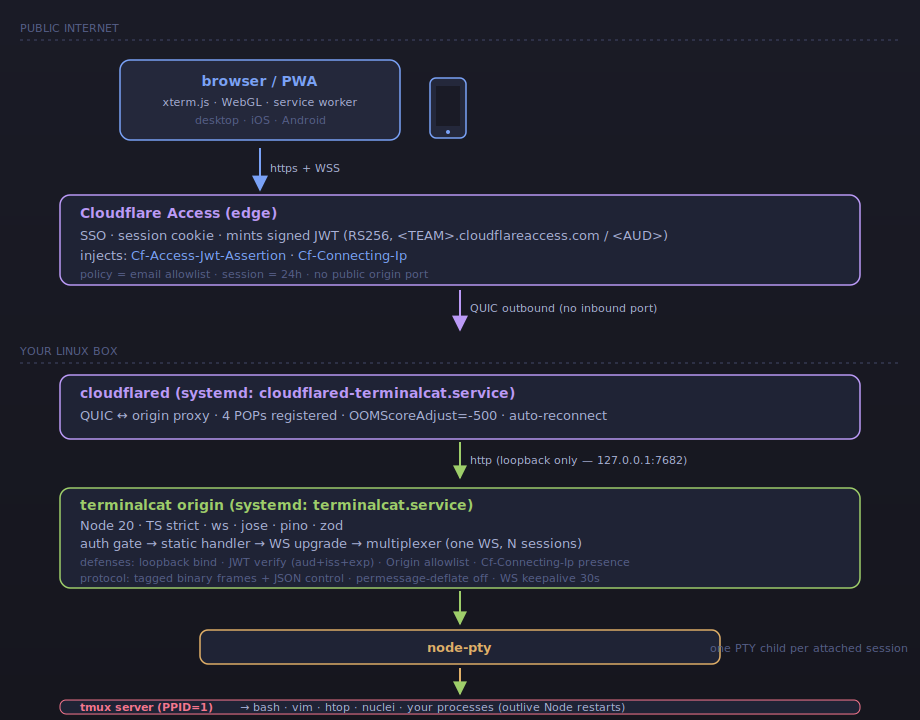

# terminalcat
{: .fs-9 }

A web terminal you run on your own box. Closing the browser doesn't kill your
processes. Use it from a phone during travel; resume from the laptop when you
land. Auth-gated by Cloudflare Access at the edge — no public ports.
{: .fs-5 .fw-300 }

[Get started](./getting-started.html){: .btn .btn-primary .fs-5 .mb-4 .mb-md-0 .mr-2 }
[Source on GitHub](https://github.com/anandsreekumaras/terminalcat){: .btn .fs-5 .mb-4 .mb-md-0 }

---

## Why this exists

Existing options had problems for the workflow I actually wanted (long-running
scans + drafts that survive a closed laptop):

|  | terminalcat | code-server | gotty / wetty / ttyd |
|---|---|---|---|
| Closing browser → process keeps running | ✅ (tmux owns it) | ❌ (kills bash on disconnect) | ⚠️ no built-in tmux integration |
| Multi-session tabs | ✅ | ❌ (single shell) | ❌ |
| Mobile-friendly (helper bar, sticky modifiers, pinch-zoom font) | ✅ | ⚠️ minimal | ❌ |
| File upload + download (web ↔ box) | ✅ (drag-drop + `webdl` CLI) | ⚠️ via VS Code only | ❌ |
| Cloudflare Access JWT verified at origin | ✅ | ⚠️ via reverse proxy | ⚠️ via reverse proxy |
| PWA-installable (Add to Home Screen) | ✅ | ✅ | ❌ |

If you need IDE features, multi-user partitioning, collaboration, or commercial
support — try something else. Single-tenant by design.

---

## Architecture at a glance

A request flows top-to-bottom: browser → Cloudflare Access (SSO + JWT mint) → cloudflared QUIC tunnel → loopback origin → node-pty → tmux. Detailed walkthrough in [Architecture](./architecture.html).

---

## Performance

Reference build (Node 20.20.2, aarch64 Debian 12, single loopback origin
behind Cloudflare Access):

| | |
|---|---|
| Cold start (`systemctl start` → port listening) | ~580 ms |
| WS connect → first server message | 2 ms warm, ~14 ms cold |
| Keystroke round-trip (stdin → bash echo via PTY+tmux+bash) | **median 0.8 ms · p95 1.1 ms** |
| Stdout throughput (TTY+tmux limited, not Node) | ~1.2 MB/s |
| Resize control → PTY reflects new size | median 2.9 ms |
| Idle RSS / threads / FDs | 53 MB / 11 / 25 |
| Survived in-house WS fuzz | ~100 hostile frames, no crash |

---

## Status

Personal project shared in case it's useful. PRs welcome, issues read as
time permits, **no support SLA**. Read the [Security](./security.html)
page before deploying to anything you care about.

## License

[MIT](https://github.com/anandsreekumaras/terminalcat/blob/main/LICENSE).
